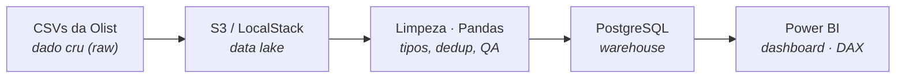

# olist-pipeline

**Pipeline de dados end-to-end** que investiga uma pergunta de negócio real sobre o e-commerce brasileiro:

> ### 🎯 O tempo de entrega afeta a avaliação do cliente?

Um pipeline completo — da ingestão de CSVs crus até o dashboard analítico — construído sobre o [Brazilian E-Commerce Public Dataset by Olist](https://www.kaggle.com/datasets/olistbr/brazilian-ecommerce) (~100 mil pedidos reais anonimizados).

**Stack:** `Python` · `Pandas` · `PostgreSQL` · `SQLAlchemy` · `Docker` · `LocalStack/S3` · `boto3` · `Power BI` · `Git`

---

## 🚧 Status do projeto

Projeto **em construção**, desenvolvido em camadas — cada uma roda e é validada antes da próxima. Isso é uma escolha de engenharia deliberada: nunca estar depurando várias frentes novas ao mesmo tempo.

| Camada | Descrição | Status |
|--------|-----------|--------|
| **1 · Ingestão + Limpeza** | Leitura dos CSVs, tratamento de tipos, dedup, validação por régua externa | ✅ **Completa** |
| **2 · Warehouse (PostgreSQL)** | Modelagem com PK/FK, carga idempotente, QA de integridade | ✅ **Completa** |
| **3 · Data Lake (LocalStack/S3)** | Camada raw no S3 simulado via Docker + boto3 | ⬜ Em construção |
| **4 · Dashboard (Power BI)** | Análise da pergunta de negócio via DAX + visualização | ⬜ Em construção |
| **5 · Documentação final** | README de vitrine + histórico Git limpo | ⬜ Em construção |

---

## 🍳 Arquitetura — o fluxo do dado

Da despensa ao prato: o dado cru pousa no data lake, é limpo e estruturado no warehouse, e vira análise no dashboard.



> **Nota de arquitetura:** a *ordem de construção* difere da *ordem do fluxo do dado*. O PostgreSQL foi construído antes do S3 (começar pela peça mais familiar dá chão firme), mas no fluxo do produto o S3 vem antes (data lake → warehouse). As duas ordens estão corretas — só não devem ser confundidas.

---

## 🧱 O que já está construído

### Camada 1 — Ingestão + Limpeza (`src/ingestao.py`, `src/limpeza.py`)

- Leitura crua dos CSVs **antes** de qualquer tratamento — para diagnosticar o dado como ele chega, não como se gostaria que fosse.
- Conversão de datas com `errors='coerce'`, validada por **régua externa**: os nulos pós-conversão são conferidos contra o baseline do diagnóstico (garante que nenhuma data válida foi silenciosamente corrompida).
- **Deduplicação de reviews** por pedido, mantendo a avaliação mais recente — decisão de negócio documentada, não default silencioso.
- Cada transformação trava com `assert` honesto (mede uma relação que *pode* quebrar, não uma tautologia).

### Camada 2 — Warehouse PostgreSQL (`src/carga.py`, `config.py`)

- **Modelagem consciente dos tipos a serviço do cálculo:** `TIMESTAMP` e não `DATE` para preservar a hora (o cálculo `entrega − compra` depende dela); `SMALLINT` para o score no domínio 1–5.
- **Chaves como contrato:** PK em `order_id`, FK `reviews.order_id → orders.order_id`. A integridade referencial é garantida pelo banco, não por checagem manual.
- **Carga idempotente por full-refresh** (`TRUNCATE` + `append`): re-execução nunca duplica nem suja — o resultado é sempre idêntico à saída da limpeza.
- **A FK revelou um buraco de escopo:** a carga apontou 2.849 reviews órfãs (avaliações de pedidos fora do escopo de entrega). Foram filtradas conscientemente, garantindo `reviews ⊆ orders`.
- **QA por régua externa dupla:** `COUNT(*)` confere a quantidade contra a limpeza + `LEFT JOIN` confirma zero órfãs (quantidade *e* relação).
- **Segurança:** credenciais isoladas em `.env` (fora do versionamento); `config.py` lê de variáveis de ambiente, pronto para migrar a Docker/nuvem sem alterar código.

---

## 📁 Estrutura do projeto

```
olist-pipeline/
├── data/
│   ├── raw/            # CSVs crus da Olist (imutáveis, fora do Git)
│   └── processed/      # saída limpa (regerável)
├── src/
│   ├── ingestao.py     # responsabilidade única: ler os CSVs
│   ├── limpeza.py      # responsabilidade única: tratar tipos, dedup, validar
│   └── carga.py        # responsabilidade única: carregar no PostgreSQL
├── notebooks/          # exploração e diagnóstico (rascunho, não é o pipeline)
├── config.py           # caminhos + connection string (config ≠ código)
├── requirements.txt
└── .gitignore          # dados e credenciais fora do versionamento
```

---

## 🔍 Princípios de engenharia aplicados

- **Verificar por régua externa, nunca por "rodou sem erro".** Todo passo fecha conferindo contra um número que veio de fora do próprio cálculo.
- **Falhar cedo e alto.** Asserts e restrições de banco expõem inconsistências no ponto de origem — como a FK que revelou as reviews órfãs.
- **Responsabilidade única.** Cada módulo faz uma coisa; o filtro de escopo mora na carga, não na limpeza.
- **Escopo como disciplina.** Modelagem dimensional (star schema) e carga incremental (upsert) foram reconhecidas e **conscientemente adiadas** — não se constrói estrada que ninguém vai pisar ainda.

---

## 🚀 Como executar (camadas 1–2)

```bash
# ambiente
python -m venv .venv && source .venv/bin/activate
pip install -r requirements.txt

# configurar credenciais do PostgreSQL
cp .env.example .env   # e preencher

# rodar a carga (ingestão → limpeza → PostgreSQL)
python -m src.carga
```

---

## 👤 Autor

**Vlad Ramos** — Engenharia de Dados
[GitHub](https://github.com/vlad-ramos-data-engineer)

---

> *Projeto de portfólio em desenvolvimento ativo. As camadas 3–5 estão em construção — acompanhe o histórico de commits para o progresso.*
